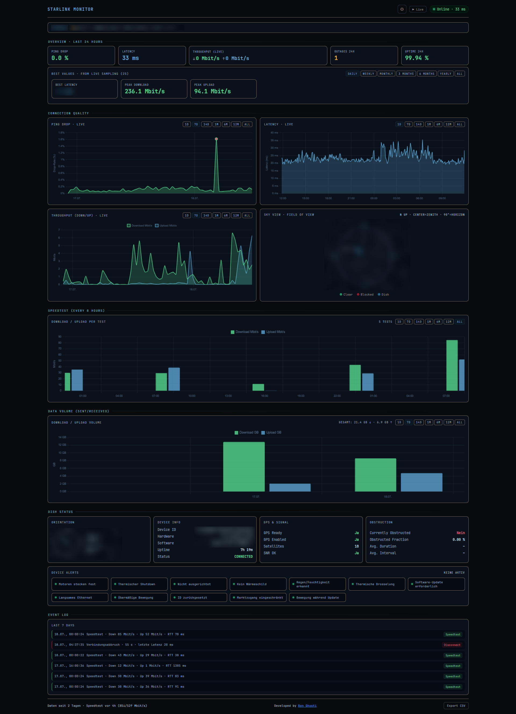

# Starlink Monitor v2

A lightweight, self-hosted web dashboard and telemetry collector designed to monitor Starlink connection quality, satellite tracking, and dish hardware performance in real-time. Optimized for Unraid and Docker environments.

---

## 📊 Features

### Real-Time Dashboard
* **Live Telemetry:** 2-second sampling rate for instant updates on **Ping Drop (%)**, **Latency (ms)**, **Jitter (ms)** and **Live Throughput (Mbit/s)**.
* **Jitter Analysis:** Live jitter from the 2s latency samples plus retroactive jitter across the whole history (2s-exact for recent data, minute/hour-based approximations labeled in the UI for older ranges).
* **Dish Health Score:** Weighted 0-100 score (drop 30 %, latency 25 %, obstruction 20 %, uptime 15 %, alerts 10 %) with a per-factor breakdown.
* **Weather Correlation:** Active weather warnings drawn as bands on the latency chart, plus a "latency/drop during storm vs. normal" insight card.
* **SLA & Reliability:** Monthly uptime table, longest outage, MTBF and outage distribution by local hour - all computed at runtime from stored events.
* **Snapshot Export:** One-click PNG download of the current dashboard view.
* **Sky View:** Visualizes the dish orientation (Azimuth & Elevation, North-oriented, center = zenith) together with the live obstruction fraction reported by the dish.
* **Dish Hardware Telemetry:** Tracks physical orientation (Azimuth & Elevation), GPS status, SNR metrics, and hardware-level alarms.
* **Outage Statistics:** Calculates 24-hour uptime, historical peaks, and tracks average obstruction durations/intervals.
* **Tabbed Layout:** Core info on the Overview page; Quality, Data, Dish and History behind tabs.

### Data & Architecture
* **gRPC Collector:** Highly efficient Python background worker utilizing Starlink's native gRPC interface.
* **Optimized Storage:** SQLite database pre-configured with **WAL (Write-Ahead Logging)** mode for high-frequency time-series logging without performance degradation.
* **Data Management Panel:** Built-in retention controls to easily purge or filter logs (older than 7, 30, or 90 days) directly from the UI, paired with CSV data export at the finest available resolution per range (raw 2s samples for the last 24h, minutely/hourly/daily aggregates for longer ranges).
* **Clean Design:** Developer-centric interface styled with high-contrast charts (Chart.js) and clean typography using *JetBrains Mono*.

---

## 🖼️ Dashboard Preview



---

## 🛠️ Tech Stack

* **Backend / Collector:** Python 3, `grpcio`, `deep-translator` (localization)
* **Frontend:** HTML5, CSS3, JavaScript (ES6), Chart.js
* **Database:** SQLite 3 (WAL Mode)
* **Deployment:** Docker & `docker-compose`

---

## 🚀 Getting Started

### Prerequisites
* Network access to your Starlink Dish (`192.168.100.1:52001`)
* Docker and Docker Compose installed (or Unraid Docker management)

### Installation & Setup

1. **Clone the repository**
   ```bash
   git clone https://github.com/BenGhosti/StarlinkMonitor.git
   cd StarlinkMonitor
   ```

2. **Configure Environment Variables**
   ```bash
   cp .env.example .env
   ```

   > **Required:** `SESSION_SECRET` must be set to a random value before
   > starting — the API refuses to start without it. Generate one with
   > `openssl rand -hex 32` and set it in `.env`:
   > ```bash
   > openssl rand -hex 32
   > # add the output as: SESSION_SECRET=<generated-value>
   > ```
   > Also change `ADMIN_PASS` from the default value.

3. **Deploy with Docker Compose**
   ```bash
   docker-compose up -d
   ```

The dashboard will now be accessible via your configured port (e.g. `http://localhost:8080`).

---

## 📁 Project Structure

```text
StarlinkMonitor/
├── collector/          # Python background worker (gRPC polling)
├── frontend/           # Web server and dashboard UI (index.html, JS, CSS)
├── scripts/            # Maintenance, translation, and 2FA automation scripts
├── data/               # Persistent SQLite database storage (local & untracked)
├── archive/            # Local backup/ZIP folder (untracked)
├── assets/             # README images and documentation assets
├── docker-compose.yml  # Multi-container orchestration
└── README.md           # Project documentation
```

---

## 🔒 Data & Safety

### Data Isolation

The following files and directories are intentionally excluded from Git version control to prevent accidental data exposure:

- `data/` (SQLite database)
- `.env`
- `archive/*.zip`
- Temporary cache and log files

---

## © Copyright

Copyright © 2026 BenGhosti. All rights reserved.

The Starlink Monitor dashboard, web interface, database architecture, Docker configuration, and application logic are © 2026 BenGhosti.

This project incorporates and relies on components from the open-source **starlink-grpc-tools** project for communication with the Starlink terminal.

**Third-Party Software**

- **starlink-grpc-tools**
  - Copyright © the starlink-grpc-tools contributors
  - Repository: https://github.com/sparky8512/starlink-grpc-tools
  - Licensed under its respective open-source license.

Starlink is a trademark of SpaceX and is not affiliated with or endorsed by this project.